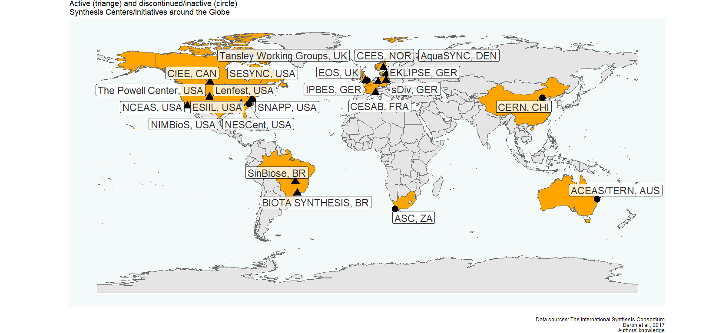

Beyond data labor: Sowing synthesis science in the Global South
================
A.L. Luza et al. in prep.
2023-03-02

<!-- README.md is generated from README.Rmd. Please edit that file -->
<!-- badges: start -->
<!-- badges: end -->

<!-- badges: start -->
<!-- badges: end -->

The map showing active and inactive/discontinued synthesis
centers/initiatives.

#### These maps were produced using the following software and associated packages:

    ## R version 4.3.0 (2023-04-21 ucrt)
    ## Platform: x86_64-w64-mingw32/x64 (64-bit)
    ## Running under: Windows 10 x64 (build 19045)
    ## 
    ## Matrix products: default
    ## 
    ## 
    ## locale:
    ## [1] LC_COLLATE=Portuguese_Brazil.utf8  LC_CTYPE=Portuguese_Brazil.utf8   
    ## [3] LC_MONETARY=Portuguese_Brazil.utf8 LC_NUMERIC=C                      
    ## [5] LC_TIME=Portuguese_Brazil.utf8    
    ## 
    ## time zone: America/Sao_Paulo
    ## tzcode source: internal
    ## 
    ## attached base packages:
    ## [1] stats     graphics  grDevices utils     datasets  methods   base     
    ## 
    ## other attached packages:
    ## [1] ggrepel_0.9.3       ggplot2_3.4.2       rnaturalearth_0.3.2
    ## [4] dplyr_1.1.2         openxlsx_4.2.5.2   
    ## 
    ## loaded via a namespace (and not attached):
    ##  [1] utf8_1.2.3              generics_0.1.3          class_7.3-21           
    ##  [4] KernSmooth_2.23-20      stringi_1.7.12          lattice_0.21-8         
    ##  [7] digest_0.6.31           magrittr_2.0.3          evaluate_0.21          
    ## [10] grid_4.3.0              fastmap_1.1.1           jsonlite_1.8.4         
    ## [13] zip_2.3.0               e1071_1.7-13            DBI_1.1.3              
    ## [16] httr_1.4.6              fansi_1.0.4             scales_1.2.1           
    ## [19] textshaping_0.3.6       cli_3.6.1               rlang_1.1.1            
    ## [22] units_0.8-2             munsell_0.5.0           withr_2.5.0            
    ## [25] yaml_2.3.7              tools_4.3.0             colorspace_2.1-0       
    ## [28] vctrs_0.6.2             R6_2.5.1                proxy_0.4-27           
    ## [31] lifecycle_1.0.3         classInt_0.4-9          ragg_1.2.5             
    ## [34] pkgconfig_2.0.3         pillar_1.9.0            gtable_0.3.3           
    ## [37] glue_1.6.2              Rcpp_1.0.10             sf_1.0-12              
    ## [40] systemfonts_1.0.4       highr_0.10              rnaturalearthdata_0.1.0
    ## [43] xfun_0.39               tibble_3.2.1            tidyselect_1.2.0       
    ## [46] rstudioapi_0.14         knitr_1.42              farver_2.1.1           
    ## [49] htmltools_0.5.5         rmarkdown_2.21          compiler_4.3.0         
    ## [52] sp_1.6-0
