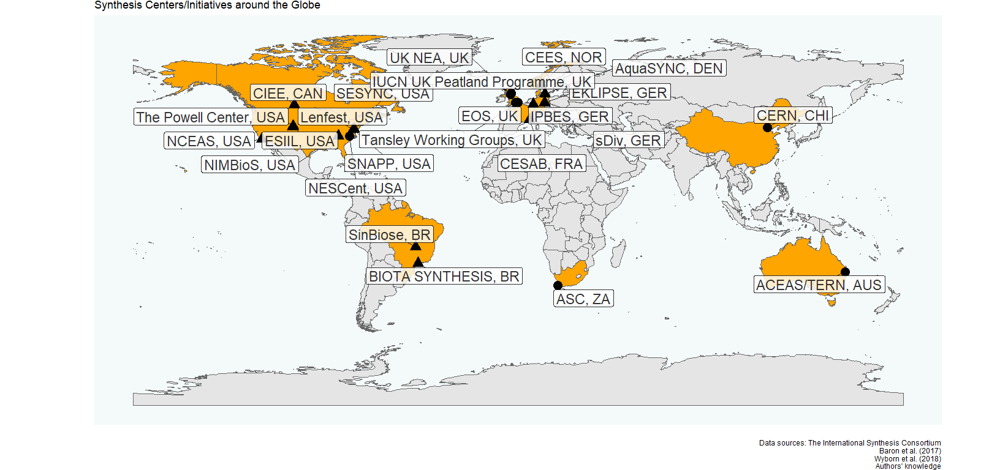

Beyond data labor: Sowing synthesis science in the Global South
================
A.L. Luza et al. in prep.
2023-03-02

<!-- README.md is generated from README.Rmd. Please edit that file -->
<!-- badges: start -->
<!-- badges: end -->

<!-- badges: start -->
<!-- badges: end -->

#### This map was produced using the following software and associated packages:

    ## R version 4.2.2 (2022-10-31 ucrt)
    ## Platform: x86_64-w64-mingw32/x64 (64-bit)
    ## Running under: Windows 10 x64 (build 19044)
    ## 
    ## Matrix products: default
    ## 
    ## locale:
    ## [1] LC_COLLATE=Portuguese_Brazil.utf8  LC_CTYPE=Portuguese_Brazil.utf8   
    ## [3] LC_MONETARY=Portuguese_Brazil.utf8 LC_NUMERIC=C                      
    ## [5] LC_TIME=Portuguese_Brazil.utf8    
    ## 
    ## attached base packages:
    ## [1] stats     graphics  grDevices utils     datasets  methods   base     
    ## 
    ## other attached packages:
    ## [1] ggrepel_0.9.2       ggplot2_3.4.0       rnaturalearth_0.3.2
    ## [4] dplyr_1.1.0         openxlsx_4.2.5.1   
    ## 
    ## loaded via a namespace (and not attached):
    ##  [1] tidyselect_1.2.0        xfun_0.36               sf_1.0-9               
    ##  [4] lattice_0.20-45         colorspace_2.1-0        vctrs_0.5.2            
    ##  [7] generics_0.1.3          htmltools_0.5.4         yaml_2.3.7             
    ## [10] utf8_1.2.2              rlang_1.0.6             e1071_1.7-12           
    ## [13] pillar_1.8.1            glue_1.6.2              withr_2.5.0            
    ## [16] DBI_1.1.3               sp_1.6-0                lifecycle_1.0.3        
    ## [19] munsell_0.5.0           gtable_0.3.1            ragg_1.2.5             
    ## [22] zip_2.2.2               evaluate_0.20           knitr_1.42             
    ## [25] fastmap_1.1.0           class_7.3-20            fansi_1.0.4            
    ## [28] highr_0.10              Rcpp_1.0.10             KernSmooth_2.23-20     
    ## [31] scales_1.2.1            classInt_0.4-8          jsonlite_1.8.4         
    ## [34] farver_2.1.1            systemfonts_1.0.4       textshaping_0.3.6      
    ## [37] digest_0.6.31           stringi_1.7.12          grid_4.2.2             
    ## [40] cli_3.6.0               tools_4.2.2             magrittr_2.0.3         
    ## [43] proxy_0.4-27            tibble_3.1.8            pkgconfig_2.0.3        
    ## [46] rmarkdown_2.20          httr_1.4.4              rstudioapi_0.14        
    ## [49] R6_2.5.1                units_0.8-1             rnaturalearthdata_0.1.0
    ## [52] compiler_4.2.2
